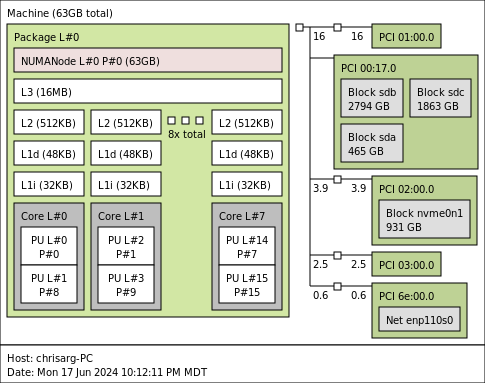

# perlAssembly

This is probably one of the things that should never be allowed to exist, but why not use Perl and its capabilities to inline foreign code, to FAFO with assembly without a build system? Everything in a single file! In the process one may find ways to use Perl to enhance NASM and vice versa. But for now, I make no such claims : I am just using the perlAssembly git repo to illustrate how one can use Perl to drive (and learn to code!) assembly programs from a single file. 

## x86-64 examples

### addIntegers.pl
Simple integer addition in Perl - this is the Hellow World version of this git repo

### addArrayofIntegers.pl
Explore multiple equivalent ways to add *large* arrays of short integers (-100 to 100 in this implementat) in Perl:
* ASM\_blank : tests the speed of calling ASM from Perl (no computations are done)
* ASM : passes the integers as bytes and then uses conversion operations and scalar floating point addition
* ASM\_doubles : passes the array as a packed string of doubles and do scalar double floating addition in assembly
* ASM\_doubles\_AVX: passes the array as a packed string of doubles and do packed floating point addition in assembly
* ForLoop : standard for loop in Perl
* ListUtil: sum function from list utilities
* PDL : uses summation in PDL

Varieties w\_alloc : allocate memory for each iteration to test the speed of pack, those marked
as wo\_alloc, use a pre-computed data structure to pass the array to the underlying code. 
Benchmarks of the first variety give the true cost of offloading summation to of a Perl array to a given 
function when the source data are in Perl. Timing the second variety benchmarks speed of the
underlying implementation.

The script illustrates 
* an important (but not the only one!) strategy to create a data structure
that is suitable for Assembly to work with, i.e. a standard array of the appropriate type, 
in which one element is laid adjacent to the previous one in memory
* the emulation of declaring a pointer as constant in the interface of a C function. In the
AVX code, we don't FAFO with the pointer (RSI in the calling convention) to the array directly,
but first load its address to another register that we manipulate at will.  

#### Results
Those were obtained on the i7 with the following topology

|                              |  mean  | median | stddev |
|------------------------------|--------|--------|--------|
|ASM\_blank                    | 2.3e-06| 2.0e-06| 1.1e-06|
|ASM\_doubles\_AVX\_w\_alloc   | 3.6e-03| 3.5e-03| 4.2e-04|
|ASM\_doubles\_AVX\_wo\_alloc  | 3.0e-04| 2.9e-04| 2.7e-05|
|ASM\_doubles\_w\_alloc        | 4.3e-03| 4.1e-03| 4.5e-04|
|ASM\_doubles\_wo\_alloc       | 8.9e-04| 8.7e-04| 3.0e-05|
|ASM\_w\_alloc                 | 4.3e-03| 4.2e-03| 4.5e-04|
|ASM\_wo\_alloc                | 9.2e-04| 9.1e-04| 4.1e-05|
|ForLoop                       | 1.9e-02| 1.9e-02| 2.6e-04|
|ListUtil                      | 4.5e-03| 4.5e-03| 1.4e-04|
|PDL\_w\_alloc                 | 2.1e-02| 2.1e-02| 6.7e-04|
|PDL\_wo\_alloc                | 9.2e-04| 9.0e-04| 3.9e-05|

#### Discussion of the addArrayofIntegers.pl example
For the example considered here, it makes ZERO senso to offload a calculation as simple as a 
summation because ListUtil is already within 15% of the assembly solution (at a latter iteration
we will also test AVX2 and AVX512 packed addition to see if we can improve the results). 
If however, one was managing the array, not as a Perl array, but as an area in memory through 
a Perl object, then one COULD consider offloading. It may be fun to consider an example in 
which one adds the output of a function that has an efficient PDL and assembly implementation
to see how the calculus changes (in the to-do list for now)
### Disclaimer
The code here is NOT meant to be portable. I code in Linux and in x86-64, so if you are looking into Window's ABI or ARM, you will be disappointed. But as my knowledge of ARM assembly grows, I intend to rewrite some examples in Arm assembly!
